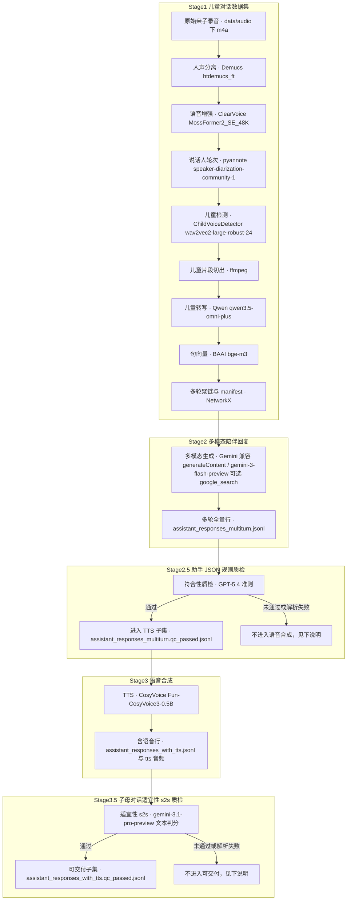

# 儿童陪伴场景 — 语音数据集与多模态对话流水线

本仓库提供一条**可复现的端到端流水线**：从亲子对话长录音中抽取儿童片段、用多模态 API 生成陪伴式回复、合成语音，并对关键阶段做自动质检。代码以 **Apache-2.0** 发布（见 [LICENSE](LICENSE)）。首次 clone 后 `outputs/` 可能为空，运行 [`main.sh`](main.sh) 后生成产物。

## 功能概览

- **Stage 1**：本地声学管线（分离 / 增强 / 说话人 / 儿童检测 / 切段）→ 儿童片段 **Qwen** 转写 → 句向量聚链 → `manifest.jsonl`（无家长间隙 ASR）。
- **Stage 2**：Gemini 兼容 **`generateContent`**，以儿童音频 + 文本历史生成结构化 JSON 回复（默认模型名由代理侧提供，见下表）。
- **Stage 2.5**：对助手 JSONL 调 **GPT‑5.4** 做规则符合性质检；**仅** `passed: true` 的整行会写入 `assistant_responses_multiturn.qc_passed.jsonl` 并进入 TTS。解析失败或 `passed: false` 的样本不进入「含语音」阶段。质检脚本写 `*.qc_state.json`（与 Qwen ASR / Stage 2 助手续跑同构），支持 `--resume` / `--max-passes` / `--state-file`；**仅**线程/API 等**技术失败**的 `manifest_line` 会进入 `failed_indices`（业务未通过不自动重试）。
- **Stage 3**：**CosyVoice** 对每轮 `plain_text` 做 zero-shot TTS（**输入为** 2.5 筛过后的 `.qc_passed.jsonl`）。
- **Stage 3.5**：对每轮 TTS 生成的 **音频** 调 **Gemini** 多模态做听感与质量质检（结合 `plain_text` / `acoustic_emotion`）；**仅** 整行所有轮次均通过时，该行 TTS 输出才写入 `assistant_responses_with_tts.qc_passed.jsonl`，作语音侧 gate 后的交付子集。同样提供 `*.qc_state.json` 与 `--resume` / `--max-passes`；状态中的 `failed_indices` 仅含**未捕获异常**等技术失败行（听感未通过等仍写入 detail，但不自动进入下一轮）。

入口脚本：**[`main.sh`](main.sh)**（Git Bash / WSL / Linux / macOS）。远程 API 调用日志落在 **`api_call/api_logs/`**（由 `api_call` 内 logger 记录；流水线通过 `sys.path` 引用该目录下模块，**请勿在发行版中修改 `api_call/` 内实现**——若需换端点或密钥，请通过环境变量与代理配置处理）。

## 依赖与环境

| 项目 | 说明 |
|------|------|
| 操作系统 | Linux / macOS / Windows（Windows 请用 **Git Bash** 执行 `.sh` 脚本） |
| Python | 3.10 / 3.11（不要用 3.13，CosyVoice 部分依赖可能没有 wheel） |
| ffmpeg | 系统可执行文件在 `PATH` 中 |
| GPU | 可无 GPU；只有 CPU 时必须设置 `COSYVOICE_FORCE_CPU=1`，速度会明显变慢 |
| 网络 | `pip`、Hugging Face 权重、CosyVoice 代码/权重、Demucs 权重、远程 API 调用需要 |

## 全新 CPU 机器运行步骤

下面假设你从 git 仓库全新 clone，机器只有 CPU。`artifacts/`、`outputs/`、`data/audio/`、`.env` 和 API 日志都不会随 git 上传，需要在每台机器本地重新准备。

### 1. 克隆仓库并准备系统依赖

```bash
git clone <你的仓库地址>
cd children_companion_scenario
```

请先确认本机已有：

- `git`
- `bash`（Windows 安装 Git for Windows 后使用 Git Bash）
- `ffmpeg`，且 `ffmpeg -version` 可执行
- Python 3.10 或 3.11

### 2. 创建 Python 环境并安装依赖

Windows Git Bash：

```bash
python -m venv .venv
source .venv/Scripts/activate
python -m pip install -U pip wheel setuptools
python -m pip install --index-url https://download.pytorch.org/whl/cpu "torch==2.8.0" "torchaudio==2.8.0"
python -m pip install -r constraints.txt
python -m pip install -e .
```

Linux / macOS 只需把激活命令换成：

```bash
source .venv/bin/activate
```

### 3. 下载 Stage 1 离线资产

先在 Hugging Face 网页接受 `pyannote/speaker-diarization-community-1` 等 gated 模型条款，然后设置 token。权重会下载到本地 `artifacts/models/`；如果 ClearerVoice 推理源码缺失，脚本会补到 `vendor/ClearerVoice-Studio/clearvoice/`。

```bash
export HF_TOKEN=你的_huggingface_token
python scripts/bootstrap_assets.py --hf-token "$HF_TOKEN"
python scripts/bootstrap_assets.py --check-only
```

该步骤会准备：

- `pyannote/speaker-diarization-community-1`
- `audeering/wav2vec2-large-robust-24-ft-age-gender`
- `BAAI/bge-m3`
- `alibabasglab/MossFormer2_SE_48K`
- Demucs `htdemucs_ft`
- ClearerVoice 推理源码

如果无法使用 `scripts/bootstrap_assets.py` 自动下载，也可以手动下载。手动放置完成后，仍然用 `python scripts/bootstrap_assets.py --check-only` 验证目录是否正确。

#### Stage 1 手动下载清单

`pyannote/speaker-diarization-community-1` 需要先在 Hugging Face 网页接受模型条款：

```text
https://huggingface.co/pyannote/speaker-diarization-community-1/tree/main
```

下载并保持目录结构，放到：

```text
artifacts/models/pyannote/speaker-diarization-community-1/
```

至少需要存在：

```text
artifacts/models/pyannote/speaker-diarization-community-1/config.yaml
artifacts/models/pyannote/speaker-diarization-community-1/embedding/pytorch_model.bin
artifacts/models/pyannote/speaker-diarization-community-1/plda/plda.npz
artifacts/models/pyannote/speaker-diarization-community-1/plda/xvec_transform.npz
artifacts/models/pyannote/speaker-diarization-community-1/segmentation/pytorch_model.bin
```

儿童声音分类模型：

```text
https://huggingface.co/audeering/wav2vec2-large-robust-24-ft-age-gender/tree/main
```

下载到：

```text
artifacts/models/audeering/wav2vec2-large-robust-24-ft-age-gender/
```

需要这些文件：

```text
config.json
preprocessor_config.json
README.md
vocab.json
pytorch_model.bin
```

BGE 语义向量模型：

```text
https://huggingface.co/BAAI/bge-m3/tree/main
```

下载到：

```text
artifacts/models/baai/bge-m3/
```

需要保持目录结构，下载这些文件：

```text
1_Pooling/config.json
README.md
colbert_linear.pt
config.json
config_sentence_transformers.json
modules.json
pytorch_model.bin
sentence_bert_config.json
sentencepiece.bpe.model
sparse_linear.pt
special_tokens_map.json
tokenizer.json
tokenizer_config.json
```

ClearerVoice 增强模型权重：

```text
https://huggingface.co/alibabasglab/MossFormer2_SE_48K/tree/main
```

下载到：

```text
artifacts/models/clearvoice/MossFormer2_SE_48K/
```

需要这些文件：

```text
README.md
last_best_checkpoint
last_best_checkpoint.pt
```

Demucs 人声分离权重下载到：

```text
artifacts/models/demucs/htdemucs_ft/
```

下载 yaml：

```text
https://raw.githubusercontent.com/adefossez/demucs/main/demucs/remote/htdemucs_ft.yaml
```

保存为：

```text
artifacts/models/demucs/htdemucs_ft/htdemucs_ft.yaml
```

下载 4 个 `.th` 权重文件：

```text
https://dl.fbaipublicfiles.com/demucs/hybrid_transformer/f7e0c4bc-ba3fe64a.th
https://dl.fbaipublicfiles.com/demucs/hybrid_transformer/d12395a8-e57c48e6.th
https://dl.fbaipublicfiles.com/demucs/hybrid_transformer/92cfc3b6-ef3bcb9c.th
https://dl.fbaipublicfiles.com/demucs/hybrid_transformer/04573f0d-f3cf25b2.th
```

保存后应为：

```text
artifacts/models/demucs/htdemucs_ft/f7e0c4bc-ba3fe64a.th
artifacts/models/demucs/htdemucs_ft/d12395a8-e57c48e6.th
artifacts/models/demucs/htdemucs_ft/92cfc3b6-ef3bcb9c.th
artifacts/models/demucs/htdemucs_ft/04573f0d-f3cf25b2.th
```

ClearerVoice 推理源码下载 zip：

```text
https://github.com/modelscope/ClearerVoice-Studio/archive/refs/heads/main.zip
```

解压后会得到类似 `ClearerVoice-Studio-main/` 的目录。把该目录里面的内容复制到：

```text
vendor/ClearerVoice-Studio/clearvoice/
```

注意不要把 `ClearerVoice-Studio-main/` 整个目录套进去。最终至少应存在：

```text
vendor/ClearerVoice-Studio/clearvoice/clearvoice/__init__.py
vendor/ClearerVoice-Studio/clearvoice/clearvoice/network_wrapper.py
vendor/ClearerVoice-Studio/clearvoice/clearvoice/config/inference/MossFormer2_SE_48K.yaml
```

### 4. 下载 CosyVoice 代码和 TTS 权重

只有 CPU 的机器请显式使用 PyTorch CPU wheel：

```bash
python scripts/deploy_cosyvoice.py --torch-index-url https://download.pytorch.org/whl/cpu
```

如果 GitHub 访问不稳定，可换镜像：

```bash
export COSYVOICE_GIT_URL=<你的 CosyVoice 镜像仓库地址>
python scripts/deploy_cosyvoice.py --torch-index-url https://download.pytorch.org/whl/cpu
```

如果无法使用 `scripts/deploy_cosyvoice.py` 自动完成，也可以手动准备 CosyVoice 代码、TTS 权重和独立虚拟环境。手动准备完成后，`run_tts.sh` 会固定使用 `artifacts/cosyvoice/.venv` 里的 Python。

#### CosyVoice 手动下载清单

CosyVoice 代码仓库：

```text
https://github.com/FunAudioLLM/CosyVoice.git
```

推荐用递归克隆，确保 submodule 和官方参考音频也存在：

```bash
mkdir -p artifacts/cosyvoice
git clone --depth 1 --recursive https://github.com/FunAudioLLM/CosyVoice.git artifacts/cosyvoice/CosyVoice
```

如果已经普通 clone 过，需要补 submodule：

```bash
git -C artifacts/cosyvoice/CosyVoice submodule update --init --recursive
```

最终至少应存在：

```text
artifacts/cosyvoice/CosyVoice/requirements.txt
artifacts/cosyvoice/CosyVoice/cosyvoice/
artifacts/cosyvoice/CosyVoice/third_party/
artifacts/cosyvoice/CosyVoice/asset/zero_shot_prompt.wav
```

TTS 权重下载地址：

```text
https://huggingface.co/FunAudioLLM/Fun-CosyVoice3-0.5B-2512/tree/main
```

下载该 Hugging Face 仓库的完整文件，放到：

```text
artifacts/cosyvoice/CosyVoice/pretrained_models/Fun-CosyVoice3-0.5B/
```

注意本地目录名必须是 `Fun-CosyVoice3-0.5B`，不是 Hugging Face 仓库名里的 `Fun-CosyVoice3-0.5B-2512`。建议完整保留 Hugging Face 仓库内所有文件，不要只下载单个权重文件。

放好代码和权重后，仍需创建 CosyVoice 独立 venv 并安装依赖。可以让脚本跳过 clone 和权重下载，只做 venv / pip 安装：

```bash
python scripts/deploy_cosyvoice.py \
  --skip-clone \
  --skip-download \
  --torch-index-url https://download.pytorch.org/whl/cpu
```

手动安装等价命令如下：

```bash
python -m venv artifacts/cosyvoice/.venv

# Windows Git Bash
artifacts/cosyvoice/.venv/Scripts/python.exe -m pip install -U pip wheel setuptools
artifacts/cosyvoice/.venv/Scripts/python.exe -m pip install -r artifacts/cosyvoice/CosyVoice/requirements.txt --no-build-isolation
artifacts/cosyvoice/.venv/Scripts/python.exe -m pip install --upgrade "torch==2.8.0" "torchaudio==2.8.0" --index-url https://download.pytorch.org/whl/cpu

# Linux / macOS
artifacts/cosyvoice/.venv/bin/python -m pip install -U pip wheel setuptools
artifacts/cosyvoice/.venv/bin/python -m pip install -r artifacts/cosyvoice/CosyVoice/requirements.txt --no-build-isolation
artifacts/cosyvoice/.venv/bin/python -m pip install --upgrade "torch==2.8.0" "torchaudio==2.8.0" --index-url https://download.pytorch.org/whl/cpu
```

检查方式：

```bash
# Windows Git Bash
artifacts/cosyvoice/.venv/Scripts/python.exe -c "import torch; print(torch.__version__, torch.cuda.is_available())"

# Linux / macOS
artifacts/cosyvoice/.venv/bin/python -c "import torch; print(torch.__version__, torch.cuda.is_available())"
```

### 5. 准备本地音频和 API 密钥

```bash
mkdir -p data/audio
# 把原始亲子对话 .m4a 复制到 data/audio/，例如：
# cp /d/downloads/my_audio/*.m4a data/audio/
```

远程模型调用需要你在每台机器上自己设置环境变量，不要写入代码或提交到 git。若 Qwen / GPT-5.4 / Gemini 走同一个代理网关，通常可以这样设置：

```bash
export GEMINI_PROXY_API_KEY=你的代理密钥
export GEMINI_PROXY_BASE=http://你的网关根地址
export OPENAI_API_KEY="$GEMINI_PROXY_API_KEY"
export OPENAI_BASE_URL=http://你的网关根地址/v1
```

如需分别配置，也可以使用：

- `QWEN_OPENAI_API_KEY` / `QWEN_OPENAI_BASE_URL`：Stage 1 Qwen ASR
- `GPT54_OPENAI_API_KEY` / `GPT54_OPENAI_BASE_URL`：Stage 2.5 GPT-5.4 质检
- `GEMINI_PROXY_API_KEY` / `GEMINI_PROXY_BASE`：Stage 2 生成与 Stage 3.5 TTS 质检

### 6. CPU 一键运行

```bash
export COSYVOICE_FORCE_CPU=1
export ASSISTANT_WORKERS=1
bash main.sh
```

`main.sh` 的执行顺序：资产检查 → **Stage 1**（[`build_child_dataset.sh`](build_child_dataset.sh)：`--step 1` → Qwen → 可选人工断点 → `--step 2`）→ **Stage 2**（[`run_assistant_responses.sh`](run_assistant_responses.sh)）→ **Stage 2.5**（[`scripts/qc/verify_assistant_responses_gpt54.py`](scripts/qc/verify_assistant_responses_gpt54.py)）→ CosyVoice 虚拟环境检查/部署 → **Stage 3**（[`run_tts.sh`](run_tts.sh)，读 `*.qc_passed.jsonl`）→ **Stage 3.5**（[`scripts/qc/verify_tts_s2s_gemini.py`](scripts/qc/verify_tts_s2s_gemini.py)）。

如果只想先验证前面阶段，可用阶段开关：

```bash
# 只跑 Stage 1，生成 outputs/child_dataset/manifest.jsonl
MAIN_RUN_STAGE2=0 MAIN_RUN_STAGE3=0 bash main.sh

# 已有 manifest.jsonl 时，从 Stage 2 开始，不重跑音频切段
MAIN_RUN_STAGE1=0 MAIN_RUN_STAGE3=0 bash main.sh

# 已有 assistant_responses_multiturn.qc_passed.jsonl 时，只跑 TTS 与 3.5 质检
COSYVOICE_FORCE_CPU=1 MAIN_RUN_STAGE1=0 MAIN_RUN_STAGE2=0 bash main.sh
```

## `.gitignore` 与新机器必须重建的内容

以下内容是本地私有或可再生成内容，不会跟随 git 到另一台机器：

- `artifacts/`：Stage 1 权重、Demucs 权重、CosyVoice 代码与 TTS 权重。
- `outputs/`：流水线产物，可由 `main.sh` 重建。
- `data/audio/`：你的原始亲子录音，需要在每台机器手动复制。
- `.env`：本地密钥文件；本仓库脚本默认读取环境变量，若使用 `.env`，请先 `source .env`。
- `api_call/api_logs/`：远程 API 请求归档日志。

### 人工校验 ASR（可选）

默认 **`MAIN_MANUAL_ASR_REVIEW=0`**：Qwen 写出 `child_labels.asr.jsonl` 后直接进行 `--step 2`。

若 **`MAIN_MANUAL_ASR_REVIEW=1`**：在 Qwen 完成后、进入 `--step 2` 前**退出**；请将校对后的内容保存为 `outputs/child_dataset/child_labels.filled.jsonl` 或通过 **`MAIN_CHILD_LABELS_PATH`** 指定，再重新执行 `main.sh` 或 `build_child_dataset.sh`。

### 环境变量

| 变量 | 说明 |
|------|------|
| `MAIN_RUN_STAGE1` / `MAIN_RUN_STAGE2` / `MAIN_RUN_STAGE3` | `1`（默认）执行 / `0` 跳过该大阶段。Stage 2.5 随 Stage 2，Stage 3.5 随 Stage 3。 |
| `MAIN_MANUAL_ASR_REVIEW` | `1` 时于 Qwen 后断点待人工，见上。 |
| `MAIN_CHILD_LABELS_PATH` | 人工校对后的 labels JSONL 路径（可选）。 |
| `MAIN_BUILD_STEP` | `1` 或 `2`，强制数据集子步骤，见 [`build_child_dataset.sh`](build_child_dataset.sh)。 |
| `ASSISTANT_WORKERS` | Stage 2 并发 worker 数（默认 `4`）。 |
| `PYTHON` | 解释器路径（可选）。 |
| `COSYVOICE_FORCE_CPU` | 设为 `1` 时 TTS 走 CPU。 |

仅构建数据集时可直接运行 `bash build_child_dataset.sh`，或按 `build_child_dataset.sh` 与 [`scripts/dataset/apply_qwen_asr_to_labels.py`](scripts/dataset/apply_qwen_asr_to_labels.py) 的调用顺序分步执行。

## 输出路径

| 路径 | 说明 |
|------|------|
| `outputs/child_dataset/manifest.jsonl` | 多轮 manifest；儿童文本在 `user` / `user_*` |
| `outputs/child_dataset/child_labels.template.jsonl` | `--step 1` 模板 |
| `outputs/child_dataset/child_labels.asr.jsonl` | Qwen 机转写 `content` |
| `outputs/child_dataset/child_labels.filled.jsonl` | 人工校对后（若启用） |
| `outputs/assistant_responses_multiturn.jsonl` | 助手多轮全量（Stage 2 产物） |
| `outputs/assistant_responses_multiturn.assistant_state.json` | Stage 2 断点续跑状态（`failed_indices` / `last_pass`）；`generate_assistant_responses.py` 的 `--resume` / `--max-passes` 与 Qwen ASR 状态文件同构 |
| `outputs/assistant_responses_multiturn.qc_passed.jsonl` | **2.5 通过子集**（与上行 schema 相同；**Stage 3 TTS 唯一输入**） |
| `outputs/qc/stage2_5_gpt54_qc.jsonl` | Stage 2.5 每行质检详情（`passed` / `raw_qc` / 可选 `parse_error`） |
| `outputs/qc/stage2_5_gpt54_qc.qc_state.json` | Stage 2.5 断点状态（`failed_indices` 为 `manifest_line`，`last_pass`）；`verify_assistant_responses_gpt54.py` 的 `--resume` / `--max-passes`；全量重跑可删或换 `--output` / `--state-file` |
| `outputs/tts_generated/*.wav` | 合成音频 |
| `outputs/assistant_responses_with_tts.jsonl` | 含 `tts_audio` 的汇总（2.5 子集上合成） |
| `outputs/assistant_responses_with_tts.qc_passed.jsonl` | **3.5 通过子集**（语音侧 gate 后可交付，与上行 schema 同） |
| `outputs/qc/stage3_5_gemini_qc.jsonl` | Stage 3.5 每行质检详情（含 `turns_qc`、`line_passed`） |
| `outputs/qc/stage3_5_gemini_qc.qc_state.json` | Stage 3.5 断点状态（同上）；`verify_tts_s2s_gemini.py` 的 `--resume` / `--max-passes` |
| `api_call/api_logs/` | 远程 API 请求归档 |

## 架构与数据流

下列 **工具名 / 模型 repo 名** 与仓库内实现一致；代理上可见的**字符串模型名**（如 `gemini-3-flash-preview`）以各脚本默认或调用为准，可按环境替换。离线权重根目录为 **`artifacts/models/`**，由 `bootstrap_assets.py` 填充。



说明：  
- **2.5 为筛**：`passed: false` 或解析失败**不进入** Stage 3 TTS，详见证录 `outputs/qc/stage2_5_gpt54_qc.jsonl`；`assistant_responses_multiturn.qc_passed.jsonl` 仅通过样本。`main.sh` 在 2.5 若本批有质检行但 0 条通过则以**退出码 2** 终止。续跑：中断后凭 `stage2_5_gpt54_qc.qc_state.json` 对 `failed_indices` 执行 `verify_assistant_responses_gpt54.py --resume`；多轮自动重试技术失败行用 `--max-passes N`。  
- **3.5 为筛**：在 `assistant_responses_with_tts.jsonl` 上按**每轮 TTS 音频**多模态质检，某轮缺 `tts_audio` / 文件缺失 / `is_pass` 为 false 或解析失败则**整行**不进入可交付子集；`assistant_responses_with_tts.qc_passed.jsonl` 为**双层质检通过**的交付子集。若 3.5 本批 0 条通过，流水线**正常退出 0**，**stderr 打醒目警告**，请查 `outputs/qc/stage3_5_gemini_qc.jsonl`。续跑与多轮技术重试同上（`stage3_5_gemini_qc.qc_state.json`、`verify_tts_s2s_gemini.py --resume` / `--max-passes`）。

**Stage 1** 在 Qwen 转写与 BGE 句向量之间，若 `MAIN_MANUAL_ASR_REVIEW=1` 会中断直至人工将校对内容落盘为 `filled` 等路径；manifest 不写入家长间隙 ASR。**Stage 2** 多轮请求文本与 JSON 模式见 [`scripts/assistant/criteria_text.py`](scripts/assistant/criteria_text.py)。更细的声学前处理见 `ccs_audio_pipeline` 与 [`pipeline.py`](src/ccs_audio_pipeline/pipeline.py)。

## TTS 与设备

- 单独执行 [`run_tts.sh`](run_tts.sh) / `batch_cosyvoice_tts.py` 时，**默认**输入与主流程一致（`outputs/assistant_responses_multiturn.qc_passed.jsonl`）；若你尚未跑 2.5 而需对**全量**多轮结果合成，请显式传入 `--input outputs/assistant_responses_multiturn.jsonl`。
- 默认在可用时使用 **GPU** 跑 CosyVoice。  
- 新显卡与 torch CUDA 轮不匹配时，可按 [`scripts/deploy_cosyvoice.py`](scripts/deploy_cosyvoice.py) 与项目内说明调整 PyTorch 索引。  
- 强制 CPU：  
  `COSYVOICE_FORCE_CPU=1 bash run_tts.sh` 或 `bash main.sh` 前导出同一变量。

## License 与第三方

本仓库代码为 **Apache-2.0**。Demucs、pyannote、CosyVoice、Sentence-Transformers、BGE 与各远程 API 另受各自许可或服务条款约束；使用生成内容前请自行评估合规与儿童场景适宜性。生成内容不代表任何机构观点。
