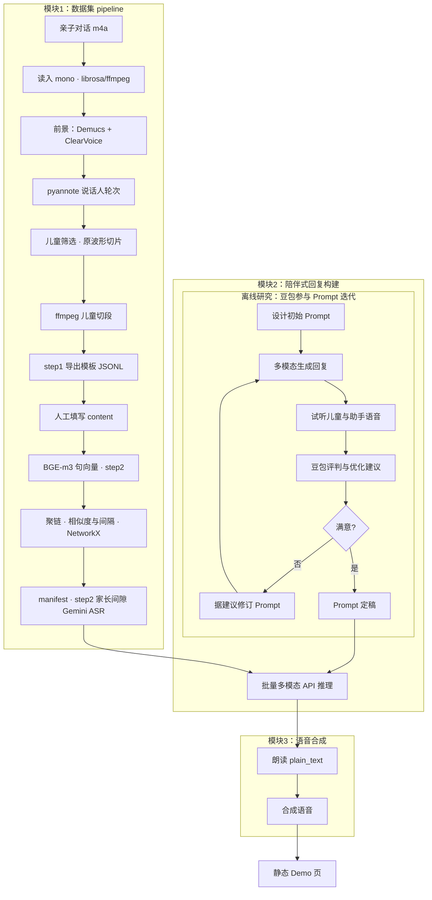

# 儿童陪伴场景 · 语音数据集与对话 Demo

从原始亲子对话音频中抽取**儿童说话片段**，构建 **manifest**，再经第三方多模态 API 生成**陪伴式回复**，并用 **CosyVoice** 合成语音，最后在浏览器中查看 **静态 Demo 页**。  
主要产物在运行后生成于 `outputs/`（clone 后可能为空，属正常）。

**仓库一键入口**：在仓库根目录执行 [`main.sh`](main.sh)（Git Bash / WSL / Linux / macOS）。该脚本串联离线资产检查、儿童数据集构建、助手回复、CosyVoice 部署（按需）、TTS 与 Demo 页。仅跑数据集或仅跑后续步骤时，可用下文环境变量跳过对应阶段。

## 你需要准备什么

- **操作系统**：Linux / macOS / Windows（脚本示例以 **Git Bash** 为准）。
- **Python**：3.10+，推荐使用 **conda** 环境（下文以 `ccs` 为例）。
- **ffmpeg**：系统可执行文件在 `PATH` 中。
- **NVIDIA GPU**：强烈推荐（数据集与 TTS 均会快很多）；CPU 也可跑，见下文 TTS 说明。
- **网络**：首次下载模型权重、克隆 CosyVoice、调用助手 API 时需要。

## 安装

```bash
conda activate ccs
pip install -r constraints.txt
pip install -e .
```

**CUDA 版 PyTorch**（与 `constraints.txt` 中版本一致；新显卡请按 [PyTorch 官网](https://pytorch.org/) 选择对应 cu 版本）示例：

```bash
pip install --upgrade "torch==2.8.0" "torchaudio==2.8.0" --index-url https://download.pytorch.org/whl/cu128
```

使用 **pyannote** 等模型前，请在 Hugging Face 网页上接受对应模型的使用条款。

## 首次下载离线资产

```bash
conda activate ccs
export HF_TOKEN=你的_huggingface_token
python scripts/bootstrap_assets.py --hf-token "$HF_TOKEN"
```

检查：

```bash
python scripts/bootstrap_assets.py --check-only
```

## 一键跑全流程（[`main.sh`](main.sh)）

将示例音频放在 `data/audio/`（默认使用其中的 `*.m4a`）。设置 **HF_TOKEN**（离线资产 / CosyVoice）。**GEMINI_PROXY_API_KEY** 或 **GEMINI_API_KEY** 在数据集 **--step 2**（家长间隙 API ASR）与助手步骤中需要；**仅跑数据集 --step 1** 时不要求 Gemini。

```bash
conda activate ccs
export GEMINI_PROXY_API_KEY=你的代理密钥
export HF_TOKEN=你的_huggingface_token   # 若尚未 bootstrap 或需首次部署 CosyVoice
export ASSISTANT_WORKERS=4               # 助手步骤并行 worker（默认 4，可按配额调小）
bash main.sh
```

**首次**执行 `bash main.sh`：若尚未存在已填写的 `outputs/child_dataset/child_labels.filled.jsonl`（见下），**[2/6]** 会跑 **`--step 1`**（模板 + 切片），随后因尚无 `manifest.jsonl` **以退出码 1 结束**并提示你人工填写——属预期流程。将模板中 `content` 填好并另存为 `child_labels.filled.jsonl`（或通过 **`MAIN_CHILD_LABELS_PATH`** 指向该文件）后，**再次** `bash main.sh`，**[2/6]** 将自动跑 **`--step 2`** 生成 manifest，并继续助手与 TTS。

`main.sh` 当前步骤为：**[1/6]** `scripts/bootstrap_assets.py --check-only` → **[2/6]** [`build_child_dataset.sh`](build_child_dataset.sh)（内部调用 `scripts/build_dataset.py`，**`--step 1` 或 `--step 2`**，见模块 1）→ **[3/6]** [`run_assistant_responses.sh`](run_assistant_responses.sh) → **[4/6]** CosyVoice venv（若不存在则 `deploy_cosyvoice.py`）→ **[5/6]** [`run_tts.sh`](run_tts.sh) → **[6/6]** `scripts/demo/generate_demo_page.py`。

**可选环境变量（均在运行 `main.sh` 前导出）**：

| 变量 | 作用 |
|------|------|
| `MAIN_SKIP_DATASET=1` | 跳过 **[2/6]** 数据集；请已有 `outputs/child_dataset/manifest.jsonl` 再继续助手与 TTS。 |
| `MAIN_SKIP_ASSISTANT=1` | 跳过助手、TTS、Demo，在 **[2/6]**（或未跳过时）之后退出。 |
| `MAIN_SKIP_TTS=1` | 跳过 TTS 与 Demo，仍跑助手。 |
| `MAIN_CHILD_LABELS_PATH` | 已填写 `content` 的 JSONL 路径（默认 `outputs/child_dataset/child_labels.filled.jsonl`）。存在该文件时，`build_child_dataset.sh` 自动执行 **`--step 2`**。 |
| `MAIN_BUILD_STEP=1` 或 `2` | 强制数据集子步骤，**覆盖**上述文件存在与否的自动推断（例如已有 filled 文件但仍想只重跑 **step 1** 时设为 `1`）。 |

**仅构建数据集、不经过 `main.sh`** 时，可直接：

```bash
bash build_child_dataset.sh
```

或显式调用（与脚本内部等价）：

```bash
python scripts/build_dataset.py --input-dir data/audio --output-dir outputs/child_dataset --step 1 --trace-dir outputs/child_dataset/trace
# 人工填写后：
python scripts/build_dataset.py --output-dir outputs/child_dataset --step 2 --labels-path outputs/child_dataset/child_labels.filled.jsonl --trace-dir outputs/child_dataset/trace
```

### 模块 1：用工具提取片段、人工儿童文本、家长 ASR 与 CPU 占用

儿童侧文本**仅**来自人工 JSONL；**不对儿童片段调用远程 API ASR**。命令行使用 **`--step 1`** / **`--step 2`**（必填其一），见 [`pipeline.py`](src/ccs_audio_pipeline/pipeline.py)。

- **`--step 1`**（[`build_child_dataset.sh`](build_child_dataset.sh) 在未检测到已填 labels 文件时自动选用）：单文件内 `load_audio_mono` → `DialogueFrontend.build_foreground_dialogue_view`（Demucs `htdemucs_ft` + ClearVoice `MossFormer2_SE_48K`）→ `extract_child_query_turns`（pyannote）→ 对**原始 mono 波形**按轮切片做 `ChildVoiceDetector` → 通过阈值的片段 **`ffmpeg` 切段** → 写出 `outputs/child_dataset/child_labels.template.jsonl`（每行 `content` 为空）与 `audios/*.m4a`。**不**跑 BGE、**不**写 `manifest.jsonl`、**不**调用 Gemini。若输出目录中已有旧的 `manifest.jsonl`，step 1 开始时会**删除**以免与未完成的标注混淆。
- **人工**：在模板中填写每段 `content`，另存为 `outputs/child_dataset/child_labels.filled.jsonl`（或任意路径并在环境变量 **`MAIN_CHILD_LABELS_PATH`** 中指定）。
- **`--step 2 --labels-path <已填.jsonl>`**（存在上述已填文件时 `build_child_dataset.sh` 自动选用）：用人工 `content` 计算 **BGE-m3** 句向量 → `build_dialogs` 聚链 → **`write_manifest`**；**家长间隙**仍通过 [`GeminiProxyAsr`](src/ccs_audio_pipeline/asr_gemini_proxy.py)（Gemini 兼容 `generateContent`）转写大人语音。需 **`GEMINI_PROXY_API_KEY`**（或 `GEMINI_API_KEY`）。仅跑助手时可设 **`MAIN_SKIP_DATASET=1`**，跳过数据集步骤。
- **ASR（调 API）**：**仅家长间隙**（及 step 2 写 manifest 时）走 **Gemini 兼容 HTTP**；默认模型名 `gemini-3-flash-preview`（可用 **`GEMINI_ASR_MODEL`** 覆盖）；可选 **`GEMINI_PROXY_BASE`**。
- **时间轴与切片**：儿童检测在解码后的 **mono 数组**上对 `[start,end)` 取片段；交付用的 `audios/*.m4a` 由 **ffmpeg 按同一时间码**从原始文件裁出，供听辨与下游路径引用。
- **减轻 CPU 占满**：模块 1 仍有 Demucs、pyannote、儿童判定、BGE 等本地计算。可调低 `build_child_dataset.sh` 中的 **`--num-threads`**（如 `4` 或 `2`），并令 OpenMP/BLAS 与之一致，例如 `export OMP_NUM_THREADS=4` 与 `export MKL_NUM_THREADS=4`，避免与 PyTorch 线程叠乘把机器打满。

## 输出在哪里

| 路径 | 说明 |
|------|------|
| `outputs/child_dataset/manifest.jsonl` | 多轮对话样本；儿童片段文本（`user`/`user_*`）来自**人工转写**；相邻两轮之间（及片尾）**家长说话**为 **API ASR**（`assistant`/`assistant_*`），可选片头 `recording_prefix_adult` |
| `outputs/child_dataset/child_labels.template.jsonl` | **`--step 1`** 时生成：每行一段待人工填写 `content`（与 **`--step 2`** 输入 schema 一致） |
| `outputs/child_dataset/audios/*.m4a` | 儿童片段音频 |
| `outputs/assistant_responses_multiturn.jsonl` | 助手回复（含 `plain_text`、`semantic_content`、`acoustic_emotion`；多轮时每轮 API 注入「孩子侧文本（与 manifest 一致的人工转写）+ 历史轮 `plain_text`（玩伴回复）」交替文本 + 本轮音频；另含整段归档字段 `recording_dialogue_ref`） |
| `outputs/tts_generated/*.wav` | 合成语音 |
| `outputs/assistant_responses_with_tts.jsonl` | 带 `tts_audio` 路径的汇总 |
| `demo_page/index.html` | 浏览器对照收听；**推荐**用 `bash demo_page/local_http.sh start` 起本地 HTTP 后打开提示的 URL（`file://` 直接打开可能无法加载 `samples_embed.json` 与音频）。`local_http.sh` 会自动探测 `PYTHON` / `python3` / `py`（含真实 `sys.executable`）/ `python`（跳过 Windows Store 占位），必要时用 `where.exe` 与 cmd 侧 PATH 对齐；仍失败可设置 `PYTHON` |
| `demo_page/samples_embed.json` | 由 `generate_demo_page.py` 生成，与 `index.html` 同目录；页面通过 `fetch` 加载样本列表（勿单独删此文件除非重新生成页面） |

## TTS：GPU 与 CPU

- **默认**：`run_tts.sh` / `main.sh` 中的 TTS 在可用时使用 **GPU**（不设置 `CUDA_VISIBLE_DEVICES`）。
- **RTX 50 系列（sm_120）建议**：先在 CosyVoice venv 里升级 GPU 版 torch（脚本已内置）：

```bash
python scripts/deploy_cosyvoice.py --skip-clone --skip-download
```

- **强制 CPU**（无 NVIDIA 驱动、或需避免 GPU 时）：

```bash
COSYVOICE_FORCE_CPU=1 bash main.sh
# 或
COSYVOICE_FORCE_CPU=1 bash run_tts.sh
```

PowerShell 写法：

```powershell
$env:COSYVOICE_FORCE_CPU="1"; bash .\run_tts.sh
```

CosyVoice 使用独立虚拟环境 `artifacts/cosyvoice/.venv`（由 `deploy_cosyvoice.py` 创建）。若整机拷贝仓库到新机器，建议在新环境中重新执行 `python scripts/deploy_cosyvoice.py` 以重建 venv。

**合成逻辑**：CosyVoice 每轮仅朗读 JSON 中的 **`plain_text`**（zero-shot，需参考音频与 prompt；见 `run_tts.sh` / `batch_cosyvoice_tts.py`）。

## 流水线概览

下图给出**模块 1 推荐路线**（与 [`run_pipeline`](src/ccs_audio_pipeline/pipeline.py) 中 **`--step 1` / `--step 2`** 一致）：读入 → `DialogueFrontend`（Demucs + ClearVoice）→ pyannote → 儿童筛选 → **ffmpeg 切段** → **导出模板并人工填写 `content`** → **BGE + 聚链** → **manifest**（其中**家长间隙**为 **`GeminiProxyAsr`** API 转写；**儿童侧不为 API ASR**）。**模块 2** 中豆包听评仅为**离线** Prompt 迭代（**未**接入 `main.sh`），定稿后的系统指令由 `generate_assistant_responses.py` 批量调用 **`generateContent`**；**模块 3** 朗读 `plain_text` 合成语音并生成 Demo。完整端到端：两次 `bash main.sh`（中间完成人工填写）或手动调用两次 `scripts/build_dataset.py` 再 `main.sh`。

### 模块 2：多模态 API 如何构建 response（请求里放了什么）

助手步骤由 [`scripts/assistant/generate_assistant_responses.py`](scripts/assistant/generate_assistant_responses.py) 调用 **Gemini 兼容** `generateContent`。**`--mode multi` 下每一轮请求**在 `contents` 末尾为**单条** `user`：文本部分由 `_multiturn_api_history_text` 构造为「孩子侧文本（与 manifest 中人工转写一致）」与「历史轮 API 返回的 `plain_text`（玩伴回复）」交替，并截至本轮孩子文本；随后拼接任务说明（`_full_task_text()`）与**本轮**儿童片段音频（`inline_data`）。该多轮请求文本**不再包含** manifest 中家长/片头 ASR。输出 JSONL 中的 **`recording_dialogue_ref`** 由 `_full_dialogue_text_from_manifest` 拼出整段对话参考（儿童为人工转写、家长等为 manifest 中的 API ASR 等），仅用于归档与页面展示，与 API 内可见文本可不一致。

| 信息类型 | 说明 |
|----------|------|
| **系统指令（任务与 JSON 格式）** | 人设、安全与互动要求，以及模型必须输出的字段 `semantic_content`、`acoustic_emotion`、`plain_text`（见脚本内 `SYSTEM_INSTRUCTION` / `_full_task_text()`）。 |
| **多轮历史文本（API 内，可选）** | 由 `_multiturn_api_history_text` 生成，经 `_RECORDING_CTX_HEADER` 前缀与任务文本拼入当前轮唯一 `user` 的文本 `part`；内容为「孩子侧文本（manifest `user`/`user_*`）+ 历史轮 `plain_text`」交替，不含 manifest 家长/片头 ASR。 |
| **当前轮儿童音频** | 本轮 `*.m4a` 经 Base64 放入 `inline_data`（默认 MIME `audio/mp4`），与上述文本在同一条 user `parts` 中一并提交。 |
| **生成配置** | `generation_config.response_mime_type = application/json`（`_build_payload(..., json_mode=True)`）；若代理不支持可回退为非 JSON 模式再解析。可选 **`--with-google-search`** 时在请求体中增加 `tools: [{google_search: {}}]`。 |

**API 返回**：模型文本经解析、校验后写入 `outputs/assistant_responses_multiturn.jsonl`（或单轮输出文件名），每轮包含 `plain_text`、`semantic_content`、`acoustic_emotion` 等。



更细的**声学处理链路**（分离增强、说话人分割、ASR、多轮链接等）见源码包 `ccs_audio_pipeline`。

## 第三方模型与许可

本仓库代码以 **Apache-2.0** 发布（见 [`LICENSE`](LICENSE)）。依赖的 **Demucs、pyannote、CosyVoice、第三方 Gemini 兼容代理（ASR 等 HTTP 调用）、Sentence-Transformers、BGE** 等本地模型权重与远程服务各有原始许可证或服务条款；用于研究或产品前请自行阅读并遵守。生成内容不代表任何机构观点。
