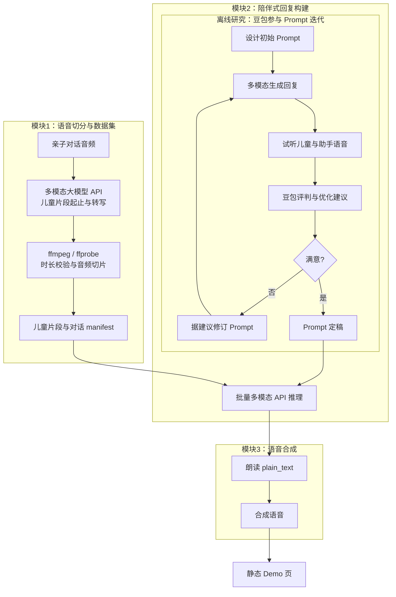

# CCS · 儿童陪伴场景语音数据集与对话 Demo

[](https://www.python.org/downloads/)
[](LICENSE)

从亲子对话**原始音频**中抽取**儿童说话片段**，生成与本地流水线字段一致的 **`manifest.jsonl`**；再经 **Gemini 兼容多模态 API** 生成**陪伴式结构化回复**，用 **CosyVoice** 合成语音，最后用静态 **`demo_page/index.html`** 在浏览器中对照收听。  
仓库 clone 后 `outputs/` 可能为空，属正常现象；运行流水线后产物写入 `outputs/`。

---

## 目录

- [功能概览](#功能概览)
- [架构](#架构)
- [仓库结构](#仓库结构)
- [环境要求](#环境要求)
- [安装](#安装)
- [快速开始](#快速开始)
- [两条构建路径](#两条构建路径)
- [环境变量](#环境变量)
- [输出说明](#输出说明)
- [TTS 与 GPU / CPU](#tts-与-gpu--cpu)
- [本地 Demo 页](#本地-demo-页)
- [开发](#开发)
- [第三方模型与许可](#第三方模型与许可)

---

## 功能概览

| 能力 | 说明 |
|------|------|
| **儿童片段与多轮 manifest** | 支持「仅 API + ffmpeg」轻量路径，或与本地声学流水线（分离、说话人、ASR 等）对齐的完整路径 |
| **陪伴式助手回复** | 批量调用 Gemini 兼容 API，输出含 `plain_text`、`semantic_content`、`acoustic_emotion` 等字段 |
| **CosyVoice TTS** | 按 JSON 中的 `plain_text` 做 zero-shot 合成，独立虚拟环境 `artifacts/cosyvoice/.venv` |
| **静态 Demo** | 生成本地可打开的 HTML，推荐通过本地 HTTP 服务播放音频（避免 `file://` 限制） |

---

## 架构

端到端关系：**模块 1** 在默认（`main.sh` / `build_child_dataset_api.sh`）路径下由**多模态大模型 API**推断儿童说话片段的起止时间与转写，本地再用 **ffmpeg** 切片并写入 manifest；另有**本地声学流水线**（pyannote、ASR 等）可选，见下文「两条构建路径」。**模块 2** 批量多模态推理生成结构化回复 → **模块 3** TTS → **Demo**。其中「豆包听评迭代 Prompt」属于离线研究环节，**未**在 `main.sh` 中自动化。



更细的声学处理链路见 Python 包 **`ccs_audio_pipeline`**（`src/ccs_audio_pipeline/`）。

---

## 仓库结构

| 路径 | 说明 |
|------|------|
| `src/ccs_audio_pipeline/` | 核心库：流水线 CLI、API 分段、ffmpeg 工具等 |
| `scripts/` | 资产引导、数据集构建、助手回复、CosyVoice 部署、Demo 生成等脚本 |
| `data/audio/` | 默认放置输入 `*.m4a` |
| `outputs/` | 默认输出根目录（manifest、切片音频、助手 JSONL、TTS、Demo） |
| `artifacts/cosyvoice/` | CosyVoice 虚拟环境与相关资源（部署脚本生成） |
| `demo_page/` | 生成的 `index.html` 与 `local_http.sh` 本地服务 |
| `constraints.txt` | 与 `pyproject.toml` 对齐的依赖锁版本，安装时使用 |

安装后以控制台命令 **`build-child-dataset`** 调用本地完整流水线入口（见 `pyproject.toml` 的 `[project.scripts]`）。

---

## 环境要求

- **系统**：Linux / macOS / Windows（shell 示例以 **Git Bash** / WSL 为准）。
- **Python**：3.10+，推荐使用 **conda**（下文以环境名 `ccs` 为例）。
- **ffmpeg / ffprobe**：在 `PATH` 中可执行。
- **NVIDIA GPU**：数据集与 TTS 强烈建议；CPU 亦可运行（见下文）。
- **网络**：首次下载模型、克隆 CosyVoice、调用 API 时需要。

使用 **pyannote** 等需在 Hugging Face 网页接受相应模型的使用条款；拉取权重需 **`HF_TOKEN`**。

---

## 安装

```bash
conda activate ccs
pip install -r constraints.txt
pip install -e .
```

**CUDA 版 PyTorch**（版本需与 `constraints.txt` 一致；新显卡请按 [PyTorch 官网](https://pytorch.org/) 选择 cu 版本）示例：

```bash
pip install --upgrade "torch==2.8.0" "torchaudio==2.8.0" --index-url https://download.pytorch.org/whl/cu128
```

### 首次下载离线资产（仅「本地声学流水线」需要）

```bash
conda activate ccs
export HF_TOKEN=你的_huggingface_token
python scripts/bootstrap_assets.py --hf-token "$HF_TOKEN"
```

检查：

```bash
python scripts/bootstrap_assets.py --check-only
```

---

## 快速开始

将示例音频放在 **`data/audio/`**（默认使用其中的 `*.m4a`）。设置 **Gemini 兼容代理**的 API 密钥（由你的代理服务商提供，**不是** Google AI Studio 官方 key 时仍按你方服务商说明配置）。

```bash
conda activate ccs
export GEMINI_PROXY_API_KEY=你的代理密钥
export HF_TOKEN=你的_huggingface_token   # 首次部署 CosyVoice 拉权重时需要
export ASSISTANT_WORKERS=4                 # 助手步骤并行数，可按配额调小
bash main.sh
```

`main.sh` 依次：**API 儿童数据集**（`build_child_dataset_api.sh`）→ **助手回复** →（若尚无 CosyVoice 环境则）**`scripts/deploy_cosyvoice.py`** → **TTS** → **生成 `demo_page/index.html`**。

可选跳过（维护/调试）：

- **`MAIN_SKIP_ASSISTANT=1`**：只做数据集后退出。  
- **`MAIN_SKIP_TTS=1`**：跳过 TTS 与 Demo（需已有关助手输出时再配合使用）。

---

## 两条构建路径

### A. 模块一 · 仅 API + ffmpeg（无本地深度学习模型）

不加载 pyannote、儿童分类器、本地 ASR、句子嵌入：由**多模态 API**给出儿童段起止与转写等，本地仅 **ffprobe 校验 + ffmpeg 切片**，**`manifest.jsonl` 与 `audios/` 字段形态与本地流水线一致**。需要网络、`ffmpeg`/`ffprobe`、以及 **`GEMINI_PROXY_API_KEY` 或 `GEMINI_API_KEY`**。

```bash
conda activate ccs
export GEMINI_PROXY_API_KEY=你的代理密钥
bash build_child_dataset_api.sh
```

自定义目录：

```bash
python scripts/build_dataset_api.py --input-dir data/audio --output-dir outputs/child_dataset
```

可选环境变量：`GEMINI_PROXY_BASE`（与助手脚本默认一致）、`GEMINI_SEGMENT_MODEL`（默认 `gemini-3-flash-preview`）。

### B. 本地声学流水线（`build_child_dataset.sh`）

依赖仓库 **离线资产**（Demucs、pyannote、FireRedASR 等），需先完成「首次下载离线资产」。**不调用助手 API** 时：

```bash
bash build_child_dataset.sh
```

---

## 环境变量

| 变量 | 用途 |
|------|------|
| `GEMINI_PROXY_API_KEY` / `GEMINI_API_KEY` | 助手与 API 分段步骤的密钥（至少设其一） |
| `GEMINI_PROXY_BASE` | Gemini 兼容 API 基地址（可选） |
| `GEMINI_SEGMENT_MODEL` | 分段所用模型名（可选） |
| `HF_TOKEN` | Hugging Face：bootstrap 资产、CosyVoice 首次部署等 |
| `ASSISTANT_WORKERS` | `run_assistant_responses.sh` 并行 worker 数（默认 `4`） |
| `COSYVOICE_FORCE_CPU` | 设为 `1` 时 CosyVoice 强制 CPU |
| `PYTHON` | 指定 Python 可执行文件（部分脚本与 `demo_page/local_http.sh` 会用到） |
| `MAIN_SKIP_ASSISTANT` | 非空则 `main.sh` 在数据集后退出 |
| `MAIN_SKIP_TTS` | 非空则跳过 TTS 与 Demo |

---

## 输出说明

| 路径 | 说明 |
|------|------|
| `outputs/child_dataset/manifest.jsonl` | 多轮对话样本；含儿童片段 ASR（`user`/`user_*`）及相邻轮次间家长说话 ASR（`assistant`/`assistant_*`），可选片头 `recording_prefix_adult` |
| `outputs/child_dataset/audios/*.m4a` | 儿童片段音频 |
| `outputs/assistant_responses_multiturn.jsonl` | 助手回复（含 `plain_text`、`semantic_content`、`acoustic_emotion`；多轮含历史摘要与 `recording_dialogue_ref`） |
| `outputs/tts_generated/*.wav` | 合成语音 |
| `outputs/assistant_responses_with_tts.jsonl` | 汇总 TTS 路径字段（如 `tts_audio`） |
| `demo_page/index.html` | 浏览器对照收听 |

---

## TTS 与 GPU / CPU

- **默认**：`run_tts.sh` / `main.sh` 中 TTS 在可用时使用 **GPU**。
- **RTX 50 系列（sm_120）**：可在 CosyVoice venv 内按 `deploy_cosyvoice.py` 说明升级 GPU 版 PyTorch。
- **强制 CPU**：

```bash
COSYVOICE_FORCE_CPU=1 bash main.sh
# 或
COSYVOICE_FORCE_CPU=1 bash run_tts.sh
```

PowerShell 示例：

```powershell
$env:COSYVOICE_FORCE_CPU="1"; bash .\run_tts.sh
```

CosyVoice 使用独立虚拟环境 **`artifacts/cosyvoice/.venv`**。整机拷贝仓库到新机器时，建议在新环境重新执行 **`python scripts/deploy_cosyvoice.py`** 以重建 venv。

**合成逻辑**：每轮仅朗读 JSON 中的 **`plain_text`**（zero-shot，参考音频与 prompt 见 `run_tts.sh` / `batch_cosyvoice_tts.py`）。

---

## 本地 Demo 页

推荐使用 **`bash demo_page/local_http.sh start`** 启动本地 HTTP，按终端提示在浏览器打开 URL。直接 **`file://` 打开**可能无法播放音频。  
`local_http.sh` 会探测 `PYTHON` / `python3` / `py` / `python`（并跳过 Windows Store 占位）；仍失败时可显式设置 **`PYTHON`**。

---

## 开发

```bash
pip install -e ".[dev]"
ruff check src scripts
```

（测试目录当前未包含自动化测试；欢迎通过 Issue / PR 补充。）

---

## 第三方模型与许可

本仓库代码以 **Apache-2.0** 发布，见 [`LICENSE`](LICENSE)。依赖的 **Demucs、pyannote、CosyVoice、FireRedASR、Sentence-Transformers、BGE** 等第三方权重各有原始许可证；用于研究或产品前请自行阅读并遵守。生成内容不代表任何机构观点。
