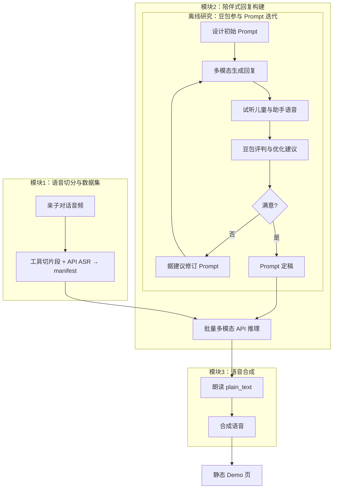

# 儿童陪伴场景 · 语音数据集与对话 Demo

从原始亲子对话音频中抽取**儿童说话片段**，构建 **manifest**，再经第三方多模态 API 生成**陪伴式回复**，并用 **CosyVoice** 合成语音，最后在浏览器中查看 **静态 Demo 页**。  
主要产物在运行后生成于 `outputs/`（clone 后可能为空，属正常）。

## 你需要准备什么

- **操作系统**：Linux / macOS / Windows（脚本示例以 **Git Bash** 为准）。
- **Python**：3.10+，推荐使用 **conda** 环境（下文以 `ccs` 为例）。
- **ffmpeg**：系统可执行文件在 `PATH` 中。
- **NVIDIA GPU**：强烈推荐（数据集与 TTS 均会快很多）；CPU 也可跑，见下文 TTS 说明。
- **网络**：首次下载模型权重、克隆 CosyVoice、调用助手 API 时需要。

## 安装

```bash
conda activate ccs
pip install -r constraints.txt
pip install -e .
```

**CUDA 版 PyTorch**（与 `constraints.txt` 中版本一致；新显卡请按 [PyTorch 官网](https://pytorch.org/) 选择对应 cu 版本）示例：

```bash
pip install --upgrade "torch==2.8.0" "torchaudio==2.8.0" --index-url https://download.pytorch.org/whl/cu128
```

使用 **pyannote** 等模型前，请在 Hugging Face 网页上接受对应模型的使用条款。

## 首次下载离线资产

```bash
conda activate ccs
export HF_TOKEN=你的_huggingface_token
python scripts/bootstrap_assets.py --hf-token "$HF_TOKEN"
```

检查：

```bash
python scripts/bootstrap_assets.py --check-only
```

## 一键跑全流程

将示例音频放在 `data/audio/`（默认使用其中的 `*.m4a`）。设置**第三方 Gemini 兼容代理**的密钥（由你的代理服务商提供，不是 Google AI Studio 官方 key）。**模块 1 数据集转写与模块 2 助手**均使用该密钥（见 `src/ccs_audio_pipeline/asr_gemini_proxy.py`）。

```bash
conda activate ccs
export GEMINI_PROXY_API_KEY=你的代理密钥
export HF_TOKEN=你的_huggingface_token   # 若尚未 bootstrap 或需首次部署 CosyVoice
export ASSISTANT_WORKERS=4               # 助手步骤并行 worker（默认 4，可按配额调小）
bash main.sh
```

`main.sh` 会依次：检查离线资产 → 构建儿童数据集 → 生成助手回复 →（若尚无 CosyVoice 虚拟环境则）运行 `scripts/deploy_cosyvoice.py` → TTS → 生成 `demo_page/index.html`。

**仅构建数据集、不调用助手 API**时，可执行：

```bash
bash build_child_dataset.sh
```

### 模块 1：用工具提取片段、ASR 调 API 与 CPU 占用

- **片段提取**：在 Demucs、pyannote 等本地声学/说话人流程判定儿童轮次后，使用 **ffmpeg** 等工具从原始亲子对话中**切出**儿童片段音频（`outputs/child_dataset/audios/`），并写入 **manifest**；具体链路见包 `ccs_audio_pipeline`（如 `pipeline.py` 中的 ffmpeg 切分）。
- **ASR（调 API）**：儿童片段与家长间隙的转写**不跑本地 ASR 模型**，统一通过 **GEMINI 兼容 HTTP** 调用远端 API（[`GeminiProxyAsr`](d:/personal_code/children_companion_scenario/src/ccs_audio_pipeline/asr_gemini_proxy.py)），需 **`GEMINI_PROXY_API_KEY`**（或 `GEMINI_API_KEY`）；可选 **`GEMINI_PROXY_BASE`**、**`GEMINI_ASR_MODEL`**、**`GEMINI_ASR_PROMPT`**。单独跑 `bash build_child_dataset.sh` 前也需设置上述密钥。
- **减轻 CPU 占满**：模块 1 仍有 Demucs、pyannote、儿童判定、BGE 等本地计算。可调低 `build_child_dataset.sh` 中的 **`--num-threads`**（如 `4` 或 `2`），并令 OpenMP/BLAS 与之一致，例如 `export OMP_NUM_THREADS=4` 与 `export MKL_NUM_THREADS=4`，避免与 PyTorch 线程叠乘把机器打满。

## 输出在哪里

| 路径 | 说明 |
|------|------|
| `outputs/child_dataset/manifest.jsonl` | 多轮对话样本；除儿童片段 ASR（`user`/`user_*`）外，含相邻两轮之间（及片尾）**家长说话 ASR**（`assistant`/`assistant_*`），可选片头 `recording_prefix_adult` |
| `outputs/child_dataset/audios/*.m4a` | 儿童片段音频 |
| `outputs/assistant_responses_multiturn.jsonl` | 助手回复（含 `plain_text`、`semantic_content`、`acoustic_emotion`；多轮时历史轮以文本摘要注入；`recording_dialogue_ref` 为按轮次截断的亲子转录参考文本，多轮时每轮可含 `recording_dialogue_ref`） |
| `outputs/tts_generated/*.wav` | 合成语音 |
| `outputs/assistant_responses_with_tts.jsonl` | 带 `tts_audio` 路径的汇总 |
| `demo_page/index.html` | 浏览器对照收听；**推荐**用 `bash demo_page/local_http.sh start` 起本地 HTTP 后打开提示的 URL（`file://` 直接打开可能无法播放音频）。`local_http.sh` 会自动探测 `PYTHON` / `python3` / `py`（含真实 `sys.executable`）/ `python`（跳过 Windows Store 占位），必要时用 `where.exe` 与 cmd 侧 PATH 对齐；仍失败可设置 `PYTHON` |

## TTS：GPU 与 CPU

- **默认**：`run_tts.sh` / `main.sh` 中的 TTS 在可用时使用 **GPU**（不设置 `CUDA_VISIBLE_DEVICES`）。
- **RTX 50 系列（sm_120）建议**：先在 CosyVoice venv 里升级 GPU 版 torch（脚本已内置）：

```bash
python scripts/deploy_cosyvoice.py --skip-clone --skip-download
```

- **强制 CPU**（无 NVIDIA 驱动、或需避免 GPU 时）：

```bash
COSYVOICE_FORCE_CPU=1 bash main.sh
# 或
COSYVOICE_FORCE_CPU=1 bash run_tts.sh
```

PowerShell 写法：

```powershell
$env:COSYVOICE_FORCE_CPU="1"; bash .\run_tts.sh
```

CosyVoice 使用独立虚拟环境 `artifacts/cosyvoice/.venv`（由 `deploy_cosyvoice.py` 创建）。若整机拷贝仓库到新机器，建议在新环境中重新执行 `python scripts/deploy_cosyvoice.py` 以重建 venv。

**合成逻辑**：CosyVoice 每轮仅朗读 JSON 中的 **`plain_text`**（zero-shot，需参考音频与 prompt；见 `run_tts.sh` / `batch_cosyvoice_tts.py`）。

## 流水线概览

下图给出端到端技术路线：**模块 1** 用工具（如 ffmpeg）从原始对话中切出儿童片段，**ASR 通过 Gemini 兼容 API** 写入 manifest；**模块 2** 先在**离线研究阶段**通过豆包听评迭代 Prompt，定稿后再做**批量多模态推理**写出结构化回复；**模块 3** 将文本合成为语音并用于 **Demo**。豆包参与的一环为研究/手工 Prompt 工程，**未**在 `main.sh` 中自动化；全量跑通仓库流水线可使用上文「一键跑全流程」中的 `bash main.sh`。



更细的**声学处理链路**（分离增强、说话人分割、ffmpeg 切片段、API ASR、多轮链接等）见源码包 `ccs_audio_pipeline`。

## 第三方模型与许可

本仓库代码以 **Apache-2.0** 发布（见 [`LICENSE`](LICENSE)）。依赖的 **Demucs、pyannote、CosyVoice、Sentence-Transformers、BGE** 等第三方权重各有原始许可证与条款；用于研究或产品前请自行阅读并遵守。生成内容不代表任何机构观点。
