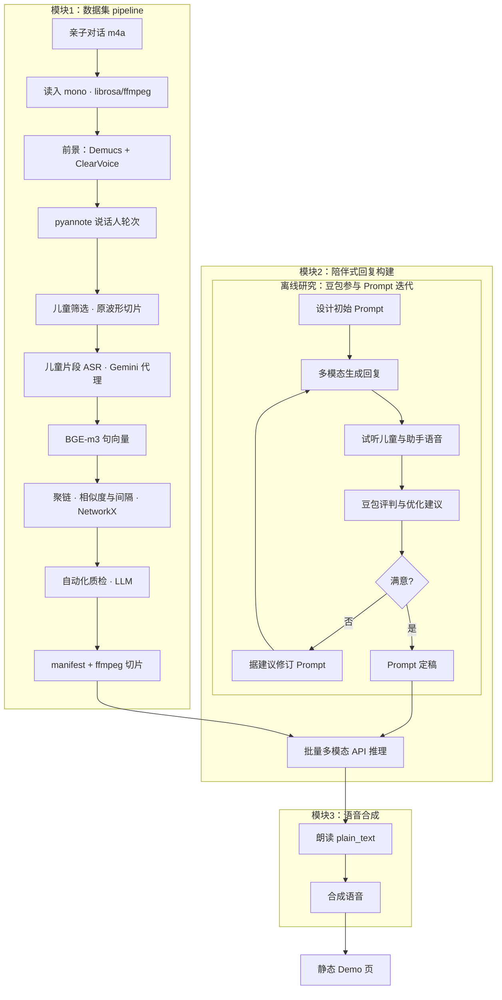

# 儿童陪伴场景 · 语音数据集与对话 Demo

从原始亲子对话音频中抽取**儿童说话片段**，构建 **manifest**，再经第三方多模态 API 生成**陪伴式回复**，并用 **CosyVoice** 合成语音，最后在浏览器中查看 **静态 Demo 页**。  
主要产物在运行后生成于 `outputs/`（clone 后可能为空，属正常）。

## 你需要准备什么

- **操作系统**：Linux / macOS / Windows（脚本示例以 **Git Bash** 为准）。
- **Python**：3.10+，推荐使用 **conda** 环境（下文以 `ccs` 为例）。
- **ffmpeg**：系统可执行文件在 `PATH` 中。
- **NVIDIA GPU**：强烈推荐（数据集与 TTS 均会快很多）；CPU 也可跑，见下文 TTS 说明。
- **网络**：首次下载模型权重、克隆 CosyVoice、调用助手 API 时需要。

## 安装

```bash
conda activate ccs
pip install -r constraints.txt
pip install -e .
```

**CUDA 版 PyTorch**（与 `constraints.txt` 中版本一致；新显卡请按 [PyTorch 官网](https://pytorch.org/) 选择对应 cu 版本）示例：

```bash
pip install --upgrade "torch==2.8.0" "torchaudio==2.8.0" --index-url https://download.pytorch.org/whl/cu128
```

使用 **pyannote** 等模型前，请在 Hugging Face 网页上接受对应模型的使用条款。

## 首次下载离线资产

```bash
conda activate ccs
export HF_TOKEN=你的_huggingface_token
python scripts/bootstrap_assets.py --hf-token "$HF_TOKEN"
```

检查：

```bash
python scripts/bootstrap_assets.py --check-only
```

## 一键跑全流程

将示例音频放在 `data/audio/`（默认使用其中的 `*.m4a`）。设置**第三方 Gemini 兼容代理**的密钥（由你的代理服务商提供，不是 Google AI Studio 官方 key）：

```bash
conda activate ccs
export GEMINI_PROXY_API_KEY=你的代理密钥
export HF_TOKEN=你的_huggingface_token   # 若尚未 bootstrap 或需首次部署 CosyVoice
export ASSISTANT_WORKERS=4               # 第3步并行 worker（默认 4，可按配额调小）
bash main.sh
```

`main.sh` 会依次：检查离线资产 → 构建儿童数据集 → 生成助手回复 →（若尚无 CosyVoice 虚拟环境则）运行 `scripts/deploy_cosyvoice.py` → TTS → 生成 `demo_page/index.html`。

**仅构建数据集、不调用助手 API**时，可执行：

```bash
bash build_child_dataset.sh
```

### 模块 1：用工具提取片段、ASR 调 API 与 CPU 占用

- **处理顺序**（单文件内）：`load_audio_mono` → `DialogueFrontend.build_foreground_dialogue_view`（Demucs `htdemucs_ft` + ClearVoice `MossFormer2_SE_48K`）→ `extract_child_query_turns`（pyannote）→ 对**读入后的原始 mono 波形**按轮切片做 `ChildVoiceDetector` → 通过阈值的片段经 **`GeminiProxyAsr`** 得到转写与句向量（`SentenceTransformer` / `BAAI/bge-m3`）→ `build_dialogs` 聚链 → `cut_audio`（ffmpeg）与 **`write_manifest`**：先对家长间隙再次 `GeminiProxyAsr`，再对每个儿童轮次做 **纯文本 LLM 自动化质检**（`run_automated_qa` / `GeminiProxyAsr.generate_json_from_text`），写入 `child_turn_qa` 后落盘。细节见 [`pipeline.py`](src/ccs_audio_pipeline/pipeline.py)。
- **ASR（调 API）**：儿童片段与家长间隙的转写**不跑本地 ASR 模型**，统一通过 **Gemini 兼容 HTTP** `generateContent`（[`GeminiProxyAsr`](src/ccs_audio_pipeline/asr_gemini_proxy.py)），默认模型名为 `gemini-3-flash-preview`（可用 **`GEMINI_ASR_MODEL`** 覆盖）；默认 ASR Prompt 为英文多语言儿童转写说明（可用 **`GEMINI_ASR_PROMPT`** 覆盖）；需 **`GEMINI_PROXY_API_KEY`**（或 `GEMINI_API_KEY`）；可选 **`GEMINI_PROXY_BASE`**。质检 LLM 默认与 ASR 同模型，可用 **`GEMINI_QA_MODEL`** 单独指定。并行质检可传 **`--qa-workers`**（默认 `4`）。单独跑 `bash build_child_dataset.sh` 前也需设置上述密钥。
- **减轻 CPU 占满**：模块 1 仍有 Demucs、pyannote、儿童判定、BGE 等本地计算。可调低 `build_child_dataset.sh` 中的 **`--num-threads`**（如 `4` 或 `2`），并令 OpenMP/BLAS 与之一致，例如 `export OMP_NUM_THREADS=4` 与 `export MKL_NUM_THREADS=4`，避免与 PyTorch 线程叠乘把机器打满。

## 输出在哪里

| 路径 | 说明 |
|------|------|
| `outputs/child_dataset/manifest.jsonl` | 多轮对话样本；除儿童片段 ASR（`user`/`user_*`）外，含相邻两轮之间（及片尾）**家长说话 ASR**（`assistant`/`assistant_*`），可选片头 `recording_prefix_adult`；每样本含 **`child_turn_qa`**（每儿童轮次 `qa_status` / `qa_reason` 等，供过滤或人工复核） |
| `outputs/child_dataset/audios/*.m4a` | 儿童片段音频 |
| `outputs/assistant_responses_multiturn.jsonl` | 助手回复（含 `plain_text`、`semantic_content`、`acoustic_emotion`；多轮时每轮 API 注入“孩子 ASR + 历史轮 `plain_text`（玩伴回复）”交替文本 + 本轮音频；另含整段归档字段 `recording_dialogue_ref`） |
| `outputs/tts_generated/*.wav` | 合成语音 |
| `outputs/assistant_responses_with_tts.jsonl` | 带 `tts_audio` 路径的汇总 |
| `demo_page/index.html` | 浏览器对照收听；**推荐**用 `bash demo_page/local_http.sh start` 起本地 HTTP 后打开提示的 URL（`file://` 直接打开可能无法加载 `samples_embed.json` 与音频）。`local_http.sh` 会自动探测 `PYTHON` / `python3` / `py`（含真实 `sys.executable`）/ `python`（跳过 Windows Store 占位），必要时用 `where.exe` 与 cmd 侧 PATH 对齐；仍失败可设置 `PYTHON` |
| `demo_page/samples_embed.json` | 由 `generate_demo_page.py` 生成，与 `index.html` 同目录；页面通过 `fetch` 加载样本列表（勿单独删此文件除非重新生成页面） |

## TTS：GPU 与 CPU

- **默认**：`run_tts.sh` / `main.sh` 中的 TTS 在可用时使用 **GPU**（不设置 `CUDA_VISIBLE_DEVICES`）。
- **RTX 50 系列（sm_120）建议**：先在 CosyVoice venv 里升级 GPU 版 torch（脚本已内置）：

```bash
python scripts/deploy_cosyvoice.py --skip-clone --skip-download
```

- **强制 CPU**（无 NVIDIA 驱动、或需避免 GPU 时）：

```bash
COSYVOICE_FORCE_CPU=1 bash main.sh
# 或
COSYVOICE_FORCE_CPU=1 bash run_tts.sh
```

PowerShell 写法：

```powershell
$env:COSYVOICE_FORCE_CPU="1"; bash .\run_tts.sh
```

CosyVoice 使用独立虚拟环境 `artifacts/cosyvoice/.venv`（由 `deploy_cosyvoice.py` 创建）。若整机拷贝仓库到新机器，建议在新环境中重新执行 `python scripts/deploy_cosyvoice.py` 以重建 venv。

**合成逻辑**：CosyVoice 每轮仅朗读 JSON 中的 **`plain_text`**（zero-shot，需参考音频与 prompt；见 `run_tts.sh` / `batch_cosyvoice_tts.py`）。

## 流水线概览

下图给出端到端技术路线，与 [`run_pipeline`](src/ccs_audio_pipeline/pipeline.py) / 助手脚本一致：**模块 1** 对每段输入 `*.m4a` 做读入 → `DialogueFrontend`（Demucs 人声 + ClearVoice 增强）→ pyannote 轮次 → 在**原始波形**上儿童概率过滤 → **`GeminiProxyAsr`** 转写儿童片段与家长间隙 → BGE 向量与 NetworkX 聚链 → ffmpeg 导出切片 → **manifest 拼装阶段**对儿童轮次做 **LLM 质检**（`child_turn_qa`）并写 **manifest**；**模块 2** 中豆包听评仅为**离线** Prompt 迭代（**未**接入 `main.sh`），定稿后的系统指令由 `generate_assistant_responses.py` 批量调用 **`generateContent`**；**模块 3** 朗读 `plain_text` 合成语音并生成 Demo。全量跑通使用上文「一键跑全流程」中的 `bash main.sh`。

### 模块 2：多模态 API 如何构建 response（请求里放了什么）

助手步骤由 [`scripts/assistant/generate_assistant_responses.py`](scripts/assistant/generate_assistant_responses.py) 调用 **Gemini 兼容** `generateContent`。**`--mode multi` 下每一轮请求**在 `contents` 末尾为**单条** `user`：文本部分由 `_multiturn_api_history_text` 构造为「孩子 ASR」与「历史轮 API 返回的 `plain_text`（玩伴回复）」交替，并截至本轮孩子文本；随后拼接任务说明（`_full_task_text()`）与**本轮**儿童片段音频（`inline_data`）。该多轮请求文本**不再包含** manifest 中家长/片头 ASR。输出 JSONL 中的 **`recording_dialogue_ref`** 仍为**整段**亲子 ASR（`_full_dialogue_text_from_manifest`），仅用于归档与页面展示，与 API 内可见文本可不一致。

| 信息类型 | 说明 |
|----------|------|
| **系统指令（任务与 JSON 格式）** | 人设、安全与互动要求，以及模型必须输出的字段 `semantic_content`、`acoustic_emotion`、`plain_text`（见脚本内 `SYSTEM_INSTRUCTION` / `_full_task_text()`）。 |
| **多轮历史文本（API 内，可选）** | 由 `_multiturn_api_history_text` 生成，经 `_RECORDING_CTX_HEADER` 前缀与任务文本拼入当前轮唯一 `user` 的文本 `part`；内容为「孩子 ASR + 历史轮 `plain_text`」交替，不含 manifest 家长/片头 ASR。 |
| **当前轮儿童音频** | 本轮 `*.m4a` 经 Base64 放入 `inline_data`（默认 MIME `audio/mp4`），与上述文本在同一条 user `parts` 中一并提交。 |
| **生成配置** | `generation_config.response_mime_type = application/json`（`_build_payload(..., json_mode=True)`）；若代理不支持可回退为非 JSON 模式再解析。可选 **`--with-google-search`** 时在请求体中增加 `tools: [{google_search: {}}]`。 |

**API 返回**：模型文本经解析、校验后写入 `outputs/assistant_responses_multiturn.jsonl`（或单轮输出文件名），每轮包含 `plain_text`、`semantic_content`、`acoustic_emotion` 等。



更细的**声学处理链路**（分离增强、说话人分割、ASR、多轮链接等）见源码包 `ccs_audio_pipeline`。

## 第三方模型与许可

本仓库代码以 **Apache-2.0** 发布（见 [`LICENSE`](LICENSE)）。依赖的 **Demucs、pyannote、CosyVoice、第三方 Gemini 兼容代理（ASR/质检等 HTTP 调用）、Sentence-Transformers、BGE** 等本地模型权重与远程服务各有原始许可证或服务条款；用于研究或产品前请自行阅读并遵守。生成内容不代表任何机构观点。
