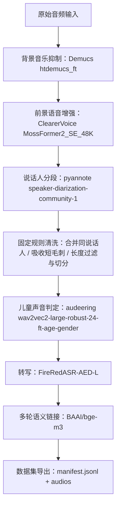

# 儿童语音数据集构建器

从 `data/audio/` 下的 `m4a` 音频中抽取**儿童说话片段**，并判定片段能否组成**单轮或多轮 user query**，最终导出 **`manifest.jsonl` + `audios/`**。  
Pipeline 为固定单路径、可离线运行（依赖与权重预先准备）；**时间边界来自「Demucs → ClearerVoice 前端增强后的 pyannote 说话人 turn」**。

## Quick Start

### 1. 环境准备

```bash
conda activate ccs
pip install -r constraints.txt
pip install -e .
```

**NVIDIA GPU（推荐）**：默认 PyPI 上的 `torch` 多为 CPU 版。安装完依赖后请再装 **CUDA 版**（与项目 `torch==2.8.0` 一致）。**RTX 50 / Blackwell（如 RTX 5070，sm_120）需 CUDA 12.8 构建**，不要用 `cu126`：

```bash
pip install --upgrade "torch==2.8.0" "torchaudio==2.8.0" --index-url https://download.pytorch.org/whl/cu128
pip install "networkx==3.3"
```

第二条用于把可能被上述安装抬升的 `networkx` 固定回与本项目 `constraints.txt` 一致。

**前提**：系统可调用 `ffmpeg`；首次下载资产时需能访问 Hugging Face / GitHub；使用 **pyannote** 前请在 Hugging Face 网页上**接受对应模型条款**。

### 2. 一次性下载离线资产

```bash
conda activate ccs
export HF_TOKEN=你的_hf_token
python scripts/bootstrap_assets.py --hf-token "$HF_TOKEN"
```

（Windows PowerShell 可将 `export` 换为 `$env:HF_TOKEN="..."` 后同样传入 `--hf-token`。）

下载完成后典型目录包括：`artifacts/models/` 下各模型权重、`vendor/ClearerVoice-Studio/`、`vendor/FireRedASR/` 等。检查是否齐全：

```bash
python scripts/bootstrap_assets.py --check-only
```

### 3. 运行

推荐使用 **Git Bash**：

```bash
conda activate ccs
sh main.sh
```

`main.sh` 在资产缺失时会提示先执行 bootstrap；成功时等价于执行：

```bash
python scripts/build_dataset.py \
  --input-dir data/audio \
  --output-dir outputs/child_dataset \
  --seed 20260409 \
  --num-threads 8 \
  --min-turn-sec 0.35 \
  --turn-merge-gap-sec 0.35 \
  --turn-glitch-max-sec 0.25 \
  --turn-glitch-gap-sec 0.2 \
  --child-threshold 0.6 \
  --max-gap-seconds 30 \
  --multi-link-threshold 0.7 \
  --max-turns 6 \
  --trace-dir outputs/child_dataset/trace
```

### 4. 输出

- `outputs/child_dataset/manifest.jsonl`：每行一条单轮或多轮对话样本（`assistant` 字段默认可留空，便于后续补全）
- `outputs/child_dataset/audios/*.m4a`：对应切片音频
- `outputs/child_dataset/trace/`（与 pipeline 步骤一致，便于回溯）：
  - `00_input_files.jsonl`：输入文件元信息
  - `01_frontend_views.jsonl`：Demucs / ClearerVoice 视图摘要
  - `02_pyannote_raw_turns.jsonl`：pyannote 原始 turn
  - `03_turn_cleanup.jsonl`：固定规则清洗记录
  - `04_diarization_projection.jsonl`：清洗后的候选时间范围与说话人
  - `05_diarization_rttm/*.rttm`：对应 diarization 的 RTTM
  - `06_child_scores.jsonl`：儿童判定分数与阈值门控
  - `07_asr_segments.jsonl`：ASR 转写结果
  - `08_link_scores.jsonl`：多轮链接分数
  - `09_dialogs.jsonl`：对话链
  - `summary.json`：汇总统计

## 输入与输出格式

- **输入**：`--input-dir` 下的 `*.m4a`（默认示例为 `data/audio/`）。
- **manifest 示例**（字段随多轮扩展）：

```json
{
  "user": "...",
  "assistant": "",
  "audio": "audios/xxx.m4a",
  "user_2": "...",
  "assistant_2": "",
  "audio_2": "audios/yyy.m4a",
  "messages": [
    {"role": "user", "text": "..."},
    {"role": "assistant", "text": ""}
  ]
}
```

**说明**：`audios/` 中仅包含 `p_child >= child_threshold` 的切片；**`manifest.jsonl` 行数**由多轮链接（`multi_link_threshold`、`max_gap_seconds`、`max_turns` 等）决定，故**音频文件数**与 **manifest 行数**可能不一致（例如多条切片合并为一轮对话）。

## Pipeline 逻辑图

下图节点采用 **「中文功能：模型或模块名」**；运行期读取本地权重与 vendor 代码，不再在线拉取。



## 注意事项

- **第三方模型**：Demucs、pyannote、audeering、FireRedASR、ClearerVoice、BGE 等各有原始许可证与使用条款，用于研究或产品前请自行核对。
- **阈值**：`--child-threshold`（默认 `0.6`）为唯一儿童判定门控；仅当 `p_child` 不低于该值时才做 ASR、导出切片并参与多轮链接。
- **GPU 加速**：请安装带 CUDA 的 PyTorch，并保证 NVIDIA 驱动可用；默认会尽量将 **pyannote**、**Demucs**、**儿童判定**、**BGE**、**FireRedASR** 等放在 GPU 上，并启用 cuDNN autotune / TF32 以提升吞吐。若 `torch.cuda.is_available()` 为 false（例如只装了 CPU 版 torch），则整体仍在 CPU 上运行，速度会明显偏慢。调试可用 `--no-gpu-fast` 关闭上述 CUDA 吞吐优化（pyannote 将留在 CPU）。
