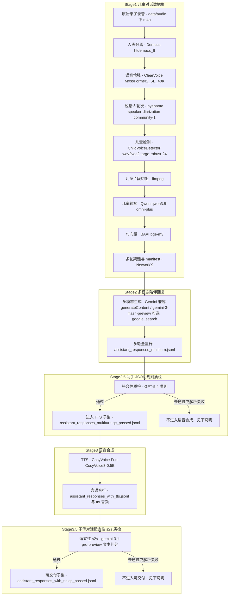

# 儿童陪伴场景 — 语音数据集与多模态对话流水线

本仓库提供一条**可复现的端到端流水线**：从亲子对话长录音中抽取儿童片段、用多模态 API 生成陪伴式回复、合成语音，并对关键阶段做自动质检。代码以 **Apache-2.0** 发布（见 [LICENSE](LICENSE)）。首次 clone 后 `outputs/` 可能为空，运行 [`main.sh`](main.sh) 后生成产物。

## 功能概览

- **Stage 1**：本地声学管线（分离 / 增强 / 说话人 / 儿童检测 / 切段）→ 儿童片段 **Qwen** 转写 → 句向量聚链 → `manifest.jsonl`（无家长间隙 ASR）。
- **Stage 2**：Gemini 兼容 **`generateContent`**，以儿童音频 + 文本历史生成结构化 JSON 回复（默认模型名由代理侧提供，见下表）。
- **Stage 2.5**：对助手 JSONL 调 **GPT‑5.4** 做规则符合性质检；**仅** `passed: true` 的整行会写入 `assistant_responses_multiturn.qc_passed.jsonl` 并进入 TTS。解析失败或 `passed: false` 的样本不进入「含语音」阶段。
- **Stage 3**：**CosyVoice** 对每轮 `plain_text` 做 zero-shot TTS（**输入为** 2.5 筛过后的 `.qc_passed.jsonl`）。
- **Stage 3.5**：对「孩子 query + 玩伴回复」文本调 **Gemini** 做 s2s 适宜性质检；**仅** 通过 3.5 的 TTS 输出行写入 `assistant_responses_with_tts.qc_passed.jsonl`，作语音侧 gate 后的交付子集。

入口脚本：**[`main.sh`](main.sh)**（Git Bash / WSL / Linux / macOS）。远程 API 调用日志落在 **`api_call/api_logs/`**（由 `api_call` 内 logger 记录；流水线通过 `sys.path` 引用该目录下模块，**请勿在发行版中修改 `api_call/` 内实现**——若需换端点或密钥，请通过环境变量与代理配置处理）。

## 依赖与环境

| 项目 | 说明 |
|------|------|
| 操作系统 | Linux / macOS / Windows（示例命令以 **Git Bash** 为准） |
| Python | 3.10+（推荐 **conda** 环境，下文以 `ccs` 为例） |
| ffmpeg | 系统可执行文件在 `PATH` 中 |
| GPU | 强烈推荐 NVIDIA GPU（数据集与 TTS）；CPU 见下文 `COSYVOICE_FORCE_CPU` |
| 网络 | 首次 `bootstrap`、CosyVoice 部署、以及各 HTTP API 调用需要 |

## 安装

```bash
conda activate ccs
pip install -r constraints.txt
pip install -e .
```

如需与 `constraints.txt` 一致的 CUDA 版 PyTorch，请从 [PyTorch 官网](https://pytorch.org/) 选择与本机 CUDA 匹配的 wheel，例如：

```bash
pip install --upgrade "torch==2.8.0" "torchaudio==2.8.0" --index-url https://download.pytorch.org/whl/cu128
```

使用 **pyannote** 等 Hugging Face 模型前，请在网页上接受相应模型使用条款。

## 离线资产与 Hugging Face

权重与清单由 [`scripts/bootstrap_assets.py`](scripts/bootstrap_assets.py) 下载到 `artifacts/models/`（具体子目录见 [`src/ccs_audio_pipeline/asset_config.py`](src/ccs_audio_pipeline/asset_config.py)）。

```bash
conda activate ccs
export HF_TOKEN=你的_huggingface_token
python scripts/bootstrap_assets.py --hf-token "$HF_TOKEN"
```

检查是否齐全：

```bash
python scripts/bootstrap_assets.py --check-only
```

## 一键运行

1. 将原始亲子对话 **m4a** 放入 `data/audio/`。  
2. 设置 **`HF_TOKEN`**（若尚未 bootstrap）。  
3. 设置 **`GEMINI_PROXY_API_KEY`** 或 **`GEMINI_API_KEY`**（Stage 2 与 Stage 3.5 需要；为同一类代理密钥）。  
4. 儿童侧转写使用 Qwen（[`api_call/api_call_qwen.py`](api_call/api_call_qwen.py) 内模型名 `qwen3.5-omni-plus`，经 OpenAI 兼容接口，与本地 `api_logs` 一致）。

```bash
conda activate ccs
export GEMINI_PROXY_API_KEY=你的密钥
export HF_TOKEN=你的_huggingface_token
export ASSISTANT_WORKERS=4
bash main.sh
```

**执行顺序**：资产检查 → **Stage 1**（[`build_child_dataset.sh`](build_child_dataset.sh)：`--step 1` → Qwen → 可选人工断点 → `--step 2`）→ **Stage 2**（[`run_assistant_responses.sh`](run_assistant_responses.sh)）→ **Stage 2.5**（[`scripts/qa/verify_assistant_responses_gpt54.py`](scripts/qa/verify_assistant_responses_gpt54.py)）→（若 2.5 本批有质检行但 0 条通过则**退出码 2**，`main.sh` 终止、**不**跑 TTS）→ CosyVoice 虚拟环境（若缺失则 `deploy_cosyvoice.py`）→ **Stage 3**（[`run_tts.sh`](run_tts.sh)，读 `*.qc_passed.jsonl`）→ **Stage 3.5**（[`scripts/qa/verify_tts_s2s_gemini.py`](scripts/qa/verify_tts_s2s_gemini.py)；若 3.5 本批 0 条通过则流水线仍以 **退出码 0** 结束，**stderr 会打醒目警告**，请查 `outputs/qa/stage3_5_gemini_qc.jsonl`）。

### 人工校验 ASR（可选）

默认 **`MAIN_MANUAL_ASR_REVIEW=0`**：Qwen 写出 `child_labels.asr.jsonl` 后直接进行 `--step 2`。

若 **`MAIN_MANUAL_ASR_REVIEW=1`**：在 Qwen 完成后、进入 `--step 2` 前**退出**；请将校对后的内容保存为 `outputs/child_dataset/child_labels.filled.jsonl` 或通过 **`MAIN_CHILD_LABELS_PATH`** 指定，再重新执行 `main.sh` 或 `build_child_dataset.sh`。

### 环境变量

| 变量 | 说明 |
|------|------|
| `MAIN_RUN_STAGE1` / `MAIN_RUN_STAGE2` / `MAIN_RUN_STAGE3` | `1`（默认）执行 / `0` 跳过该大阶段。Stage 2.5 随 Stage 2，Stage 3.5 随 Stage 3。 |
| `MAIN_MANUAL_ASR_REVIEW` | `1` 时于 Qwen 后断点待人工，见上。 |
| `MAIN_CHILD_LABELS_PATH` | 人工校对后的 labels JSONL 路径（可选）。 |
| `MAIN_BUILD_STEP` | `1` 或 `2`，强制数据集子步骤，见 [`build_child_dataset.sh`](build_child_dataset.sh)。 |
| `ASSISTANT_WORKERS` | Stage 2 并发 worker 数（默认 `4`）。 |
| `PYTHON` | 解释器路径（可选）。 |
| `COSYVOICE_FORCE_CPU` | 设为 `1` 时 TTS 走 CPU。 |

仅构建数据集时可直接运行 `bash build_child_dataset.sh`，或按 `build_child_dataset.sh` 与 [`scripts/dataset/apply_qwen_asr_to_labels.py`](scripts/dataset/apply_qwen_asr_to_labels.py) 的调用顺序分步执行。

## 输出路径

| 路径 | 说明 |
|------|------|
| `outputs/child_dataset/manifest.jsonl` | 多轮 manifest；儿童文本在 `user` / `user_*` |
| `outputs/child_dataset/child_labels.template.jsonl` | `--step 1` 模板 |
| `outputs/child_dataset/child_labels.asr.jsonl` | Qwen 机转写 `content` |
| `outputs/child_dataset/child_labels.filled.jsonl` | 人工校对后（若启用） |
| `outputs/assistant_responses_multiturn.jsonl` | 助手多轮全量（Stage 2 产物） |
| `outputs/assistant_responses_multiturn.qc_passed.jsonl` | **2.5 通过子集**（与上行 schema 相同；**Stage 3 TTS 唯一输入**） |
| `outputs/qa/stage2_5_gpt54_qc.jsonl` | Stage 2.5 每行质检详情（`passed` / `raw_qc` / 可选 `parse_error`） |
| `outputs/tts_generated/*.wav` | 合成音频 |
| `outputs/assistant_responses_with_tts.jsonl` | 含 `tts_audio` 的汇总（2.5 子集上合成） |
| `outputs/assistant_responses_with_tts.qc_passed.jsonl` | **3.5 通过子集**（语音侧 gate 后可交付，与上行 schema 同） |
| `outputs/qa/stage3_5_gemini_qc.jsonl` | Stage 3.5 每行质检详情 |
| `api_call/api_logs/` | 远程 API 请求归档 |

## 架构与数据流

下列 **工具名 / 模型 repo 名** 与仓库内实现一致；代理上可见的**字符串模型名**（如 `gemini-3-flash-preview`）以各脚本默认或调用为准，可按环境替换。离线权重根目录为 **`artifacts/models/`**，由 `bootstrap_assets.py` 填充。



说明：  
- **2.5 为筛**：`passed: false` 或解析失败**不进入** Stage 3 TTS，详见证录 `outputs/qa/stage2_5_gpt54_qc.jsonl`；`assistant_responses_multiturn.qc_passed.jsonl` 仅通过样本。`main.sh` 在 2.5 若本批有质检行但 0 条通过则以**退出码 2** 终止。  
- **3.5 为筛**：在 `assistant_responses_with_tts.jsonl` 上逐行质检，未通过/解析失败**不进入**可交付子集；`assistant_responses_with_tts.qc_passed.jsonl` 为**双层质检通过**的交付子集。若 3.5 本批 0 条通过，流水线**正常退出 0**，**stderr 打醒目警告**，请查 `outputs/qa/stage3_5_gemini_qc.jsonl`。

**Stage 1** 在 Qwen 转写与 BGE 句向量之间，若 `MAIN_MANUAL_ASR_REVIEW=1` 会中断直至人工将校对内容落盘为 `filled` 等路径；manifest 不写入家长间隙 ASR。**Stage 2** 多轮请求文本与 JSON 模式见 [`scripts/assistant/criteria_text.py`](scripts/assistant/criteria_text.py)。更细的声学前处理见 `ccs_audio_pipeline` 与 [`pipeline.py`](src/ccs_audio_pipeline/pipeline.py)。

## TTS 与设备

- 单独执行 [`run_tts.sh`](run_tts.sh) / `batch_cosyvoice_tts.py` 时，**默认**输入与主流程一致（`outputs/assistant_responses_multiturn.qc_passed.jsonl`）；若你尚未跑 2.5 而需对**全量**多轮结果合成，请显式传入 `--input outputs/assistant_responses_multiturn.jsonl`。
- 默认在可用时使用 **GPU** 跑 CosyVoice。  
- 新显卡与 torch CUDA 轮不匹配时，可按 [`scripts/deploy_cosyvoice.py`](scripts/deploy_cosyvoice.py) 与项目内说明调整 PyTorch 索引。  
- 强制 CPU：  
  `COSYVOICE_FORCE_CPU=1 bash run_tts.sh` 或 `bash main.sh` 前导出同一变量。

## License 与第三方

本仓库代码为 **Apache-2.0**。Demucs、pyannote、CosyVoice、Sentence-Transformers、BGE 与各远程 API 另受各自许可或服务条款约束；使用生成内容前请自行评估合规与儿童场景适宜性。生成内容不代表任何机构观点。
